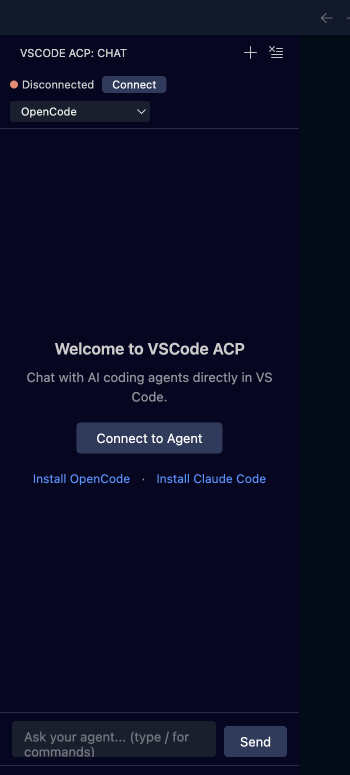

# VSCode ACP

> AI coding agents in VS Code via the Agent Client Protocol (ACP)

[](https://marketplace.visualstudio.com/items?itemName=omercnet.vscode-acp)
[](https://open-vsx.org/extension/omercnet/vscode-acp)
[](LICENSE)

Chat with Claude, OpenCode, and other ACP-compatible AI agents directly in your editor. No context switching, no copy-pasting code.



## Features

- **🤖 Multi-Agent Support** — Connect to OpenCode, Claude Code, or any ACP-compatible agent
- **💬 Native Chat Interface** — Integrated sidebar chat that feels like part of VS Code
- **🔧 Tool Visibility** — See what commands the AI runs with expandable input/output
- **📝 Rich Markdown** — Code blocks, syntax highlighting, and formatted responses
- **🔄 Streaming Responses** — Watch the AI think in real-time
- **🎛️ Mode & Model Selection** — Switch between agent modes and models on the fly
- **💾 Session Persistence** — Save and resume conversations across VS Code restarts

## Requirements

You need at least one ACP-compatible agent installed:

- **[OpenCode](https://github.com/sst/opencode)**
- **[Claude Code](https://claude.ai/code)**

## Installation

### From VS Code Marketplace

1. Open VS Code
2. Go to Extensions (`Cmd+Shift+X` / `Ctrl+Shift+X`)
3. Search for "VSCode ACP"
4. Click Install

### From VSIX

1. Download the `.vsix` file from [Releases](https://github.com/omercnet/vscode-acp/releases)
2. In VS Code: `Extensions` → `...` → `Install from VSIX...`

## Usage

1. Click the **VSCode ACP** icon in the Activity Bar (left sidebar)
2. Click **Connect** to start a session
3. Select your preferred agent from the dropdown
4. Start chatting!

### Tool Calls

When the AI uses tools (like running commands or reading files), you'll see them in a collapsible section:

- **⋯** — Tool is running
- **✓** — Tool completed successfully
- **✗** — Tool failed

Click on any tool to see the command input and output.

## Session Management

VSCode ACP automatically saves your conversation sessions, allowing you to resume where you left off even after closing VS Code.

### Commands

- **Load Session** (`Ctrl+Shift+Alt+L` / `Cmd+Shift+Alt+L`) — Browse and load a saved session
- **New Session** (`Ctrl+Shift+Alt+N` / `Cmd+Shift+Alt+N`) — Start a fresh conversation
- **Delete Session** — Remove old sessions from history

### Settings

Configure session behavior in VS Code settings (`Cmd+,` / `Ctrl+,`):

- `vscode-acp.sessions.autoSave` (default: `true`) — Automatically save after each message
- `vscode-acp.sessions.maxHistory` (default: `50`) — Maximum sessions to keep (1-200)
- `vscode-acp.sessions.showPickerOnStart` (default: `false`) — Show session picker on startup

## Configuration

The extension auto-detects installed agents. Supported agents:

| Agent       | Command    | Detection      |
| ----------- | ---------- | -------------- |
| OpenCode    | `opencode` | Checks `$PATH` |
| Claude Code | `claude`   | Checks `$PATH` |

## Development

```bash
# Clone the repo
git clone https://github.com/omercnet/vscode-acp.git
cd vscode-acp

# Install dependencies
npm install

# Compile
npm run compile

# Run in VS Code
# Press F5 to open Extension Development Host
```

## Contributing

Contributions are welcome! Please read our [Contributing Guide](CONTRIBUTING.md) first.

1. Fork the repository
2. Create your feature branch (`git checkout -b feature/amazing-feature`)
3. Commit your changes (`git commit -m 'Add amazing feature'`)
4. Push to the branch (`git push origin feature/amazing-feature`)
5. Open a Pull Request

## License

MIT © [Omer Cohen](https://omerc.net)

---

**[Report a Bug](https://github.com/omercnet/vscode-acp/issues)** · **[Request a Feature](https://github.com/omercnet/vscode-acp/issues)**
