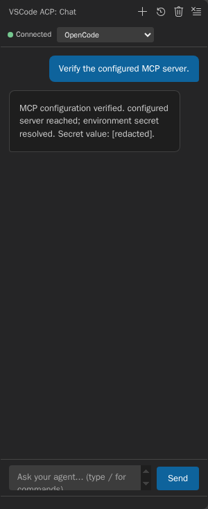

# VSCode ACP

> AI coding agents in VS Code via the Agent Client Protocol (ACP)

[](https://marketplace.visualstudio.com/items?itemName=omercnet.vscode-acp)
[](https://open-vsx.org/extension/omercnet/vscode-acp)
[](LICENSE)

Chat with Claude, OpenCode, and other ACP-compatible AI agents directly in your editor. No context switching, no copy-pasting code.


## Features

- **🤖 Multi-Agent Support** — Connect to OpenCode, Claude Code, or any ACP-compatible agent
- **💬 Native Chat Interface** — Integrated sidebar chat that feels like part of VS Code
- **🔧 Tool Visibility** — See what commands the AI runs with expandable input/output
- **📝 Rich Markdown** — Code blocks, syntax highlighting, and formatted responses
- **🔄 Streaming Responses** — Watch the AI think in real-time
- **🎛️ Mode & Model Selection** — Switch between agent modes and models on the fly
- **Authentication Handoff** — Select an ACP-advertised sign-in method when an agent requires authentication; the extension retries session creation once after successful authentication and never stores credentials.
- **MCP Server Configuration** — Connect validated stdio, HTTP, or SSE servers from user or workspace settings
- **📎 File Attachments** — Reference current or workspace files without embedding their contents

## Requirements

You need at least one ACP-compatible agent installed:

- **[OpenCode](https://github.com/sst/opencode)**
- **[Claude Code](https://claude.ai/code)**

## Installation

### From VS Code Marketplace

1. Open VS Code
2. Go to Extensions (`Cmd+Shift+X` / `Ctrl+Shift+X`)
3. Search for "VSCode ACP"
4. Click Install

### From VSIX

1. Download the `.vsix` file from [Releases](https://github.com/omercnet/vscode-acp/releases)
2. In VS Code: `Extensions` → `...` → `Install from VSIX...`

## Usage

1. Click the **VSCode ACP** icon in the Activity Bar (left sidebar)
2. Click **Connect** to start a session
3. Select your preferred agent from the dropdown
4. Start chatting!

If an agent requires ACP authentication, choose one of its advertised sign-in methods. The agent owns that flow; VSCode ACP does not ask for, store, or log API keys or other credentials.

### File Attachments

Use the paperclip button beside the prompt to select an open workspace file or browse for files inside a trusted local workspace. Selected files appear as removable chips and are sent as ACP `resource_link` blocks with their canonical file URI and name, plus MIME type and size when available. The extension stats the selected path but does not read or embed file contents when attaching it; the selected agent must be able to access the referenced URI.

### Session History

Sessions are stored in the current workspace after the first completed turn. Use **ACP: Load Session** to restore a saved conversation when the selected agent advertises ACP `loadSession`; the conversation is replayed before it accepts new prompts. **ACP: New Chat** starts a separate session. **ACP: Delete Session** removes an entry from this workspace's history only; it does not delete the agent's underlying conversation.

| Setting                          | Default | Effect                                                             |
| -------------------------------- | ------- | ------------------------------------------------------------------ |
| `vscode-acp.sessions.autoSave`   | `true`  | Persist newly created and completed sessions in workspace history. |
| `vscode-acp.sessions.maxHistory` | `50`    | Retain the most recently used 1–200 workspace sessions.            |

### Tool Calls

When the AI uses tools (like running commands or reading files), you'll see them in a collapsible section:

- **⋯** — Tool is running
- **✓** — Tool completed successfully
- **✗** — Tool failed

Click on any tool to see the command input and output.

## Configuration

The extension auto-detects installed agents from the extension host's `PATH`.
Commands are resolved to absolute executables and started from the resolved
installation directory without a shell. Relative `PATH` entries and untrusted
workspace directories are removed before launch; the workspace path is sent
separately when the ACP session starts. The same rules apply in local and remote
extension hosts.

| Agent       | Command    | Detection     |
| ----------- | ---------- | ------------- |
| OpenCode    | `opencode` | Checks `PATH` |
| Claude Code | `npx`      | Checks `PATH` |

Use `vscode-acp.agentPaths` to map an agent ID to an absolute executable path
when the command is not on `PATH`. User-level overrides remain available in
Restricted Mode. Workspace-level overrides are ignored until Workspace Trust is
granted.

On Windows, `npm`-generated `.cmd`/`.bat` shims are decoded into the interpreter
and script they invoke. Other shim styles (for example Scoop or Chocolatey
wrappers) are not decoded; point `vscode-acp.agentPaths` at the real executable
in that case.

```json
{
  "vscode-acp.agentPaths": {
    "opencode": "/opt/opencode/bin/opencode"
  }
}
```

### MCP Servers

Configure `vscode-acp.mcpServers` in user or workspace settings. Dedicated project configuration files are not read yet; that remaining source is tracked in [#112](https://github.com/omercnet/vscode-acp/issues/112). Stdio is always available; HTTP and SSE entries require the selected agent to advertise the matching ACP capability. Commands must use absolute executable paths, and remote transports require HTTPS URLs without credentials or fragments.

```json
{
  "vscode-acp.mcpServers": [
    {
      "name": "filesystem",
      "command": "/usr/bin/node",
      "args": ["/absolute/path/to/server.js"],
      "env": [{ "name": "API_KEY", "value": "${env:MCP_API_KEY}" }]
    },
    {
      "type": "http",
      "name": "remote-tools",
      "url": "https://tools.example.com/mcp",
      "headers": [
        { "name": "Authorization", "value": "Bearer ${env:MCP_API_TOKEN}" }
      ]
    }
  ]
}
```

Environment references are resolved only when a session is created or loaded. Resolved values are sent to the agent for that request and are not written back to VS Code settings or extension state. The same validated request is reused unchanged for one authentication retry. Invalid entries fail closed with a classified setting path such as `[MCP_CONFIG_UNSAFE] vscode-acp.mcpServers[0].command ...`.



## Development

```bash
# Clone the repo
git clone https://github.com/omercnet/vscode-acp.git
cd vscode-acp

# Install dependencies
npm install

# Compile
npm run compile

# Run in VS Code
# Press F5 to open Extension Development Host
```

## Contributing

Contributions are welcome! Please read our [Contributing Guide](CONTRIBUTING.md) first.

1. Fork the repository
2. Create your feature branch (`git checkout -b feature/amazing-feature`)
3. Commit your changes (`git commit -m 'Add amazing feature'`)
4. Push to the branch (`git push origin feature/amazing-feature`)
5. Open a Pull Request

## License

MIT © [Omer Cohen](https://omerc.net)

---

**[Report a Bug](https://github.com/omercnet/vscode-acp/issues)** · **[Request a Feature](https://github.com/omercnet/vscode-acp/issues)**
