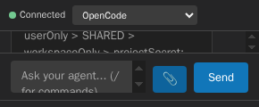
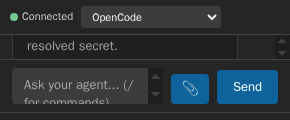

# VSCode ACP

> AI coding agents in VS Code via the Agent Client Protocol (ACP)

[](https://marketplace.visualstudio.com/items?itemName=omercnet.vscode-acp)
[](https://open-vsx.org/extension/omercnet/vscode-acp)
[](LICENSE)

Chat with Claude, OpenCode, and other ACP-compatible AI agents directly in your editor. No context switching, no copy-pasting code.


## Features

- **🤖 Multi-Agent Support** — Connect to OpenCode, Claude Code, or any ACP-compatible agent
- **💬 Native Chat Interface** — Integrated sidebar chat that feels like part of VS Code
- **🔧 Tool Visibility** — See what commands the AI runs with expandable input/output
- **📝 Rich Markdown** — Code blocks, syntax highlighting, and formatted responses
- **🔄 Streaming Responses** — Watch the AI think in real-time
- **🎛️ Mode & Model Selection** — Switch between agent modes and models on the fly
- **Authentication Handoff** — Select an ACP-advertised sign-in method when an agent requires authentication; the extension retries session creation once after successful authentication and never stores credentials.
- **MCP Server Configuration** — Connect validated stdio, HTTP, or SSE servers from user settings, workspace settings, or a trusted `.vscode/mcp.json`
- **📎 Rich Attachments**: Send file links, embedded text context, and image prompts through one capability-aware attachment flow
- **Editor Selection Context** — Press `Cmd+Shift+I` on macOS or `Ctrl+Alt+Shift+I` on Windows/Linux to attach the selected code and focus the ACP composer

## Requirements

You need at least one ACP-compatible agent installed:

- **[OpenCode](https://github.com/sst/opencode)**
- **[Claude Code](https://claude.ai/code)**

## Installation

### From VS Code Marketplace

1. Open VS Code
2. Go to Extensions (`Cmd+Shift+X` / `Ctrl+Shift+X`)
3. Search for "VSCode ACP"
4. Click Install

### From VSIX

1. Download the `.vsix` file from [Releases](https://github.com/omercnet/vscode-acp/releases)
2. In VS Code: `Extensions` → `...` → `Install from VSIX...`

## Usage

1. Open the **VSCode ACP** chat in the right-side Secondary Side Bar
2. Click **Connect** to start a session
3. Select your preferred agent from the dropdown
4. Start chatting!

If an agent requires ACP authentication, choose one of its advertised sign-in methods. The agent owns that flow; VSCode ACP does not ask for, store, or log API keys or other credentials.

The connection header shows the agent's initialized title (or name) and version when provided. This identity belongs to the active connection and clears on disconnect, connection failure, reconnect, or agent change.

### Editor Selections

Select code in a trusted workspace file, then press `Cmd+Shift+I` on macOS or `Ctrl+Alt+Shift+I` on Windows/Linux. **ACP: Add Selection to Chat** opens the ACP chat, adds a removable `path:Lx-Ly` selection chip, and focuses the composer without sending the prompt. The same command is available from the editor context menu and Command Palette.

The exact selected text is captured from the editor, including unsaved changes. Agents that advertise ACP embedded-context support receive it as a resource; other agents receive the same bounded selection as plain text.

### File and Image Attachments

Use the paperclip button beside the prompt to select an open workspace file, including an image preview tab, or browse for files inside a trusted local workspace. You can also paste images or drop image and text files onto the composer. Selected items use the same removable, keyboard-accessible chips and retain their order after the prompt text.

The extension follows the connected agent's ACP `promptCapabilities`: text files use embedded `resource` blocks, including current unsaved editor contents, only when `embeddedContext` is advertised; otherwise selected workspace files remain `resource_link` blocks. Supported PNG, JPEG, GIF, and WebP files use `image` blocks only when `image` is advertised. Pasted or dropped in-memory content is rejected with a visible error when the required capability is absent because it has no safe link fallback.

Only explicitly selected files inside a trusted local workspace are read. Symlink escapes and replacement of an already-authorized workspace root are rejected. Embedded text is limited to 1 MiB per file, images to 5 MiB each, all inline content to 10 MiB per prompt, and every prompt to 10 attachments. Oversized picked files fall back to links; oversized pasted or dropped content is rejected. Image payloads must match their declared raster format; embedded resources remain UTF-8 text rather than an alternate image transport.

You can keep typing while attachments are prepared, but Send waits until their chips are ready. If prompt preparation fails, the text and every selected attachment are restored for retry. Switching conversations discards stale preparation results. Replayed attachments use display-only chips and do not become new draft attachments.

### Session History

The **Agent Sessions** tree connects to each available agent independently, probes its advertised capabilities, and pages through agent-owned sessions when `session/list` is available. A complete agent listing becomes authoritative for that agent; partial pages and failed refreshes leave recoverable workspace history intact. Agents without listing support use this workspace history as the fallback when they advertise `session/load` or `session/resume`.

Opening a listed session deliberately chooses **Load Session with History** or **Resume Session without History**. Loading replays prior messages before accepting prompts. Resuming continues the agent context without replaying history. Authentication, stale sessions, unsupported agents, empty results, retryable errors, and additional pages appear as actionable tree states.

Sessions are stored in the current workspace after the first completed turn. **ACP: Load Session** restores a saved conversation using loading when available, otherwise resuming. **ACP: New Chat** starts a separate session. **ACP: Delete Session** removes an entry from this workspace's history only; it does not delete the agent's underlying conversation.

| Setting                          | Default | Effect                                                             |
| -------------------------------- | ------- | ------------------------------------------------------------------ |
| `vscode-acp.sessions.autoSave`   | `true`  | Persist newly created and completed sessions in workspace history. |
| `vscode-acp.sessions.maxHistory` | `50`    | Retain the most recently used 1–200 workspace sessions.            |

### Tool Calls

When the AI uses tools (like running commands or reading files), you'll see them in a collapsible section:

- **⋯** — Tool is running
- **✓** — Tool completed successfully
- **✗** — Tool failed
- **×**: Tool was cancelled before completion

Click on any tool to see the command input and output.

Agent-provided file locations appear as links inside tool details. Clicking a link opens the canonical file only if it is inside a trusted local workspace, selecting the advertised line when supplied. Missing files and locations outside that boundary show an error without navigating. Locations are never opened automatically.

### Turn Completion

Normal completion adds no extra notice. Token and turn-request limits show warnings, and cancellation shows a muted notice. A refusal explains that the user prompt and everything after it will be excluded from the agent's next prompt. These outcomes also apply when the agent returns no text or only tool output.

## Security model

VSCode ACP is not a sandbox. The selected agent runs as a local process, and an approved terminal program runs with your OS account's authority. Approving a shell, interpreter, or similar program can therefore authorize arbitrary code execution with that account's privileges.

- Permission dialogs use extension-defined decision labels and render agent-provided details as inert text. For non-terminal requests, the extension returns the selected ACP permission option to the agent; it does not enforce the agent's subsequent behavior. For terminal requests, **Allow once** authorizes one matching request, while **Always allow in this session** authorizes repeated copies of the same approved request and effective launch. These in-memory grants are revoked on disconnect, session load or replacement, agent change, **Clear Chat**, and view disposal or recreation.
- Terminal creation requires Workspace Trust, a local workspace folder, a working directory inside that folder, and a matching grant. The prompt shows the resolved executable, arguments, canonical working directory, and allowlisted environment; the extension re-resolves and rechecks them before spawning without a shell. The eight-terminal limit includes launches being prepared or retired. Process-tree cleanup runs on disconnect, session load or replacement, new chat, agent change, and extension shutdown. **Clear Chat** revokes approvals but does not stop existing terminals; merely hiding the retained view revokes neither approvals nor terminals.
- ACP file reads and writes are not individually prompted. The capabilities are advertised only for a trusted workspace with a pinnable local `file:` root, and apply only to the extension's ACP filesystem handlers, not to the agent process or an approved terminal command. Reads use descriptor traversal on supported Linux hosts and portable identity verification elsewhere; they stay within canonical workspace roots, reject traversal and symlink escapes, and return at most 16 MiB. Writes require verified `/proc/self/fd` descriptor traversal, so they are currently advertised only on supported Linux hosts; macOS, Windows, and Linux hosts without that support do not advertise writes and reject direct write requests. A write to a file with unsaved changes in an open editor is refused until the user saves or reverts those changes, including when its backing file was deleted. Writes also fail closed if an unsaved editor file cannot be identified; save or close that editor before retrying.
- Agent executables are resolved before launch without shell expansion. Bare commands search only absolute `PATH` entries, selected files and `PATH` directories are canonicalized, and relative or untrusted-workspace `PATH` entries are excluded. Supported Windows `npm` `.cmd`/`.bat` shims are decoded to the real interpreter and script. Workspace-level executable overrides remain disabled until Workspace Trust is granted; in Restricted Mode, only user-level overrides apply.

## Configuration

The extension auto-detects installed agents from the extension host's `PATH`.
Commands are resolved to absolute executables and started from the resolved
installation directory without a shell. Relative `PATH` entries and untrusted
workspace directories are removed before launch; the workspace path is sent
separately when the ACP session starts. The same rules apply in local and remote
extension hosts.

| Agent       | Command    | Detection     |
| ----------- | ---------- | ------------- |
| OpenCode    | `opencode` | Checks `PATH` |
| Claude Code | `npx`      | Checks `PATH` |

Use `vscode-acp.agentPaths` to map an agent ID to an absolute executable path
when the command is not on `PATH`. User-level overrides remain available in
Restricted Mode. Workspace-level overrides are ignored until Workspace Trust is
granted.

On Windows, `npm`-generated `.cmd`/`.bat` shims are decoded into the interpreter
and script they invoke. Other shim styles (for example Scoop or Chocolatey
wrappers) are not decoded; point `vscode-acp.agentPaths` at the real executable
in that case.

```json
{
  "vscode-acp.agentPaths": {
    "opencode": "/opt/opencode/bin/opencode"
  }
}
```

### MCP Servers

VSCode ACP accepts MCP servers from these sources, in ascending precedence:

1. User `vscode-acp.mcpServers` settings
2. Workspace `vscode-acp.mcpServers` settings
3. Workspace-folder `vscode-acp.mcpServers` settings in a multi-root workspace
4. The selected folder's `.vscode/mcp.json`

Names are compared case-insensitively. A higher-precedence source replaces a lower-precedence server with the same name; duplicate names inside one source are rejected. Workspace and project sources are ignored in Restricted Mode, while user settings remain available. For multi-root and remote workspaces, the session's exact workspace-folder URI selects both resource-scoped settings and `.vscode/mcp.json`; project files are read through the VS Code workspace filesystem rather than reconstructed as local paths. A saved URI that is no longer a workspace folder cannot inherit another folder's repository settings just because their filesystem paths match.

Settings use the ACP array shape:

```json
{
  "vscode-acp.mcpServers": [
    {
      "name": "filesystem",
      "command": "/usr/bin/node",
      "args": ["/absolute/path/to/server.js"],
      "env": [{ "name": "API_KEY", "value": "${env:MCP_API_KEY}" }]
    }
  ]
}
```

Project configuration reuses [VS Code's established `.vscode/mcp.json` convention](https://code.visualstudio.com/docs/agents/reference/mcp-configuration), not OpenCode's separate `opencode.jsonc` format. VSCode ACP supports its `servers` object with stdio `command`, `args`, and string-valued `env`, or HTTP/SSE `url` and string-valued `headers`. Unsupported sections and server properties fail closed rather than acquiring VS Code-specific behavior such as input prompts, OAuth, environment files, or sandbox configuration.

```json
{
  "servers": {
    "filesystem": {
      "command": "/usr/bin/node",
      "args": ["/absolute/path/to/server.js"],
      "env": { "API_KEY": "${env:MCP_API_KEY}" }
    },
    "remote-tools": {
      "type": "http",
      "url": "https://tools.example.com/mcp",
      "headers": {
        "Authorization": "Bearer ${env:MCP_API_TOKEN}"
      }
    }
  }
}
```

Stdio commands must be absolute executable paths. On Windows, use a native `.exe` or `.com` executable and pass scripts as separate arguments to their interpreter; batch/script command paths are rejected to avoid implicit command-shell handling. The extension sends command and argv separately to the ACP agent, which owns execution. Workspace Trust is the consent boundary for execution-capable project configuration, not a sandbox for the chosen agent or executable. Remote transports require HTTPS URLs without credentials or fragments and require the selected agent to advertise the matching ACP capability.

JSONC comments and trailing commas are accepted. Project files are checked for file type and a 256 KiB size limit before reading, checked again after reading, and limited to 16 nesting levels before parsing. Duplicate properties and malformed UTF-8 fail closed. VS Code's filesystem API reads whole files, so a file that grows after the metadata check or a provider that reports an incorrect size can still allocate more before rejection. Every source uses the same MCP schema validator and aggregate bounds as settings.

Environment references are supported only in stdio environment values and HTTP/SSE header values. They are resolved into a single request snapshot when a new or saved session starts. That snapshot is reused unchanged for one authentication retry; edits apply only to the next session boundary. Superseded configuration reads cannot start or restore a session after disconnect, agent replacement, or disposal. Resolved values are sent to the agent but are never written back to settings, `.vscode/mcp.json`, or extension state. Registered values and their JSON-escaped forms are redacted from extension diagnostics; raw agent stderr is not logged because fragmented output cannot be safely redacted. Invalid input fails closed with a structured code and source path such as `[MCP_CONFIG_UNSAFE] .vscode/mcp.json.servers[0].command ...`, without echoing project-controlled keys or values.





## Development

```bash
# Clone the repo
git clone https://github.com/omercnet/vscode-acp.git
cd vscode-acp

# Install dependencies
npm install

# Compile
npm run compile

# Run in VS Code
# Press F5 to open Extension Development Host
```

## Contributing

Contributions are welcome! Please read our [Contributing Guide](CONTRIBUTING.md) first.

1. Fork the repository
2. Create your feature branch (`git checkout -b feature/amazing-feature`)
3. Commit your changes (`git commit -m 'Add amazing feature'`)
4. Push to the branch (`git push origin feature/amazing-feature`)
5. Open a Pull Request

## License

MIT © [Omer Cohen](https://omerc.net)

---

**[Report a Bug](https://github.com/omercnet/vscode-acp/issues)** · **[Request a Feature](https://github.com/omercnet/vscode-acp/issues)**
